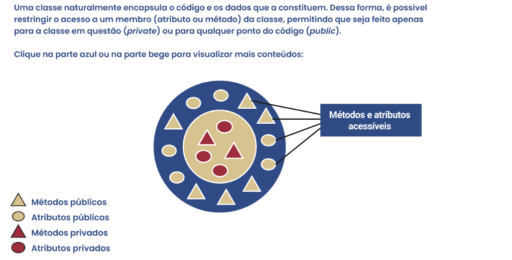

# Encapsulamento

**O encapsulamento é um recurso da orientação a objetos que permite agrupar um código e os dados por ele manipulados em 
uma única entidade, protegendo-os de interferências externas, acesso indevido e/ou utilização/modificação inadequada** 
por outro trecho de código definido fora do código encapsulado.




Vale ressaltar que as mesmas regras de acesso para atributos valem para métodos. Como boa prática, os atributos de 
instância são non-public e a maioria dos métodos, public. Isso possibilita que a conversa entre objetos seja feita por 
troca de mensagens, ou seja, acessando seus métodos, em vez de um objeto manipular diretamente atributos que não sejam 
seus.

# Herança

A herança permite que as características e os comportamentos descritos de uma classe “pai” (superclasse) sejam herdados 
por sua classe “filha” (subclasse).


Uma relação de herança significa que a subclasse herda os membros da superclasse (atributos
e métodos).

**Estas são as principais vantagens da utilização da herança:**

- Evita código duplicado.
</br></br>
- Facilita a manutenção, pois há apenas um lugar para fazer alterações em caso de modificações (superclasse), sem 
precisar modificar as subclasses.
</br></br>
- Possibilita definir um protocolo comum para um grupo de classes relacionadas.
  </br></br>
- Garante que todas as subclasses, tanto atuais como futuras, de uma superclasse tenham os mesmos métodos que 
serão herdados.
  </br></br>
- Permite estabelecer um “contrato” mínimo do que as subclasses – em qualquer nível – poderão fazer

**Fique atento à utilização da herança:**


# Polimorfismo

**Exemplo:**


Polimorfismo é a capacidade de um objeto poder ser referenciado de várias formas (o que não significa que o objeto pode 
se transformar em outro tipo).

Se tivermos um método que espera receber um objeto do tipo Pessoa, ele pode receber, em vez disso, um objeto do tipo 
Aluno ou do tipo Professor.

O polimorfismo é um recurso que permite projetar códigos com alto nível de abstração (pensando em superclasses), sem se 
preocupar com níveis mais baixos (subclasses), que poderão, inclusive, ser criados posteriormente. Isso permite a criação 
de um código flexível, simples e de fácil manutenção. Usando o polimorfismo, é possível diminuir o acoplamento entre as 
classes, evitando que modificações no código resultem em modificações em outros lugares também.

# Abstração

Ainda analisando o exemplo anterior, repare que não faz sentido termos em nosso sistema uma classe Pessoa, pois os 
usuários serão de tipos específicos, como Aluno, Professor, Coordenador, etc., mas nunca tão genéricos como Pessoa.

Entretanto, se a classe Pessoa for removida do programa, perderemos duas importantes vantagens: o reuso de código entre 
as subclasses de Pessoa e a flexibilidade de termos argumentos polimórficos nos métodos. A solução, então, é tornar 
Pessoa uma classe abstrata, significando que ela nunca poderá ser instanciada.

Em Python, uma classe abstrata deve conter pelo menos um método abstrato, e podemos criar uma classe abstrata herdando 
da superclasse para classes abstratas ABC (abstract base classes), do módulo abc. Para tal, deveremos importar este 
módulo no nosso código, como no exemplo a seguir.


Não é possível instanciar uma subclasse de uma classe abstrata sem implementar todos os seus métodos abstratos. 
Ao tornar um método abstrato, ele deverá ser obrigatoriamente implementado em todas as subclasses de uma classe 
abstrata.

# Associação, agregação e composição

Os conceitos de associação, agregação e composição permitem o relacionamento entre objetos.

Vamos usar o exemplo da classe Aluno. Imagine que você queira ampliar essa classe para guardar seu professor orientador:


Agora, imagine que o aluno tenha um histórico de ocorrências, como data de matrícula, notas obtidas, disciplinas 
cursadas e reprovações, entre outras. Nesse caso, temos um exemplo de composição.

Tanto a agregação quanto a composição são relacionamentos todo-parte.


O conceito de **agregação** em programação orientada a objetos é como uma caixa de ferramentas. Essa caixa pode conter 
várias ferramentas como martelos, chaves de fenda, etc. Cada ferramenta pode ser usada por si só, independentemente da 
caixa. Se você se livrar da caixa, as ferramentas dentro dela continuam existindo e podem ser usadas normalmente. Ou 
seja, em agregação, um objeto (a caixa de ferramentas) contém outros objetos (as ferramentas), mas esses objetos 
contidos não dependem do objeto contêiner para existir.

**Exemplo Prático de Agregação:**
Vamos imaginar um time de futebol. O time é composto por jogadores. Cada jogador é um indivíduo independente e 
continua a existir mesmo se o time for dissolvido. Aqui, o time é o objeto contêiner e os jogadores são os objetos 
contidos.

```python
class Jogador:
  def __init__(self, nome):
    self.nome = nome

class Time:
  def __init__(self, nome):
    self.nome = nome
    self.jogadores = []

  def adicionar_jogador(self, jogador):
    self.jogadores.append(jogador)

# Criando jogadores
jogador1 = Jogador("João")
jogador2 = Jogador("Maria")

# Criando um time e adicionando jogadores
time = Time("Estrelas FC")
time.adicionar_jogador(jogador1)
time.adicionar_jogador(jogador2)

# Os jogadores existem independentemente do time
print(jogador1.nome)  # João
print(jogador2.nome)  # Maria

# Se o time deixa de existir, os jogadores continuam existindo
del time
print(jogador1.nome)  # João ainda existe
```

Neste exemplo, cada jogador pode existir sem o time, mostrando que eles são independentes do time. 
Esta é a essência da agregação.


O conceito de **composição** em programação orientada a objetos refere-se a uma relação de dependência entre objetos, 
onde alguns objetos são **"partes"** de um objeto maior. Basicamente, se você apagar o objeto maior, todas as suas 
partes também serão apagadas. Isso é como pensar em um carro e suas rodas: se o carro for destruído, as rodas também 
desaparecem porque elas fazem parte do carro.

**Exemplo Prático de Composição:**
Considere um sistema para gerenciar uma biblioteca de livros. Neste sistema, cada **Livro** contém vários **Capítulos**, 
e cada capítulo não pode existir sem um livro associado. Se um livro for deletado, todos os seus capítulos também devem 
ser deletados.

```python
class Capitulo:
  def __init__(self, titulo, numero):
    self.titulo = titulo
    self.numero = numero

class Livro:
  def __init__(self, titulo):
    self.titulo = titulo
    self.capitulos = []

  def adicionar_capitulo(self, titulo, numero):
    novo_capitulo = Capitulo(titulo, numero)
    self.capitulos.append(novo_capitulo)

  def __del__(self):
    print(f'Deletando {self.titulo}, isso também deletará seus capítulos...')
    del self.capitulos

# Criando um livro
livro = Livro("O Senhor dos Anéis")

# Adicionando capítulos
livro.adicionar_capitulo("A Sociedade do Anel", 1)
livro.adicionar_capitulo("As Duas Torres", 2)

# Deletando o livro e, consequentemente, seus capítulos
del livro
```

Neste exemplo, **Livro** é uma composição de **Capitulo**. Os capítulos são criados e gerenciados inteiramente pelo livro e não 
têm existência independente fora dele. Quando o objeto **Livro** é destruído, todos os **Capitulo** associados também 
são destruídos, demonstrando a natureza "parte-todo" da composição.


