# Princípios SOLID

**Os princípios SOLID têm como objetivo ajudar a realizar um bom projeto de OO para um software de código flexível, 
escalável, sustentável e reutilizável. SOLID é um acrônimo dos cinco princípios:**

- Single responsibility principle (SPR) – Princípio de responsabilidade única
  
- Open/closed principle (OCP) – Princípio do aberto/fechado
    
- Liskov substitution principle (LSP) – Princípio da substituição de Liskov
    
- Interface segregation principle (ISP) – Princípio de segregação de interface
    
- Dependency inversion principle (DIP) – Princípio da inversão de dependência

# S

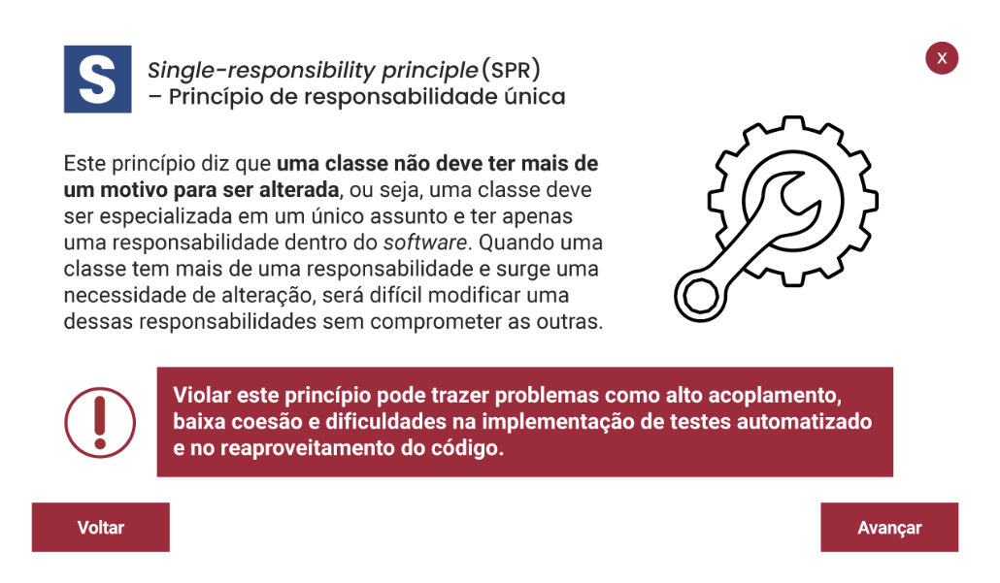

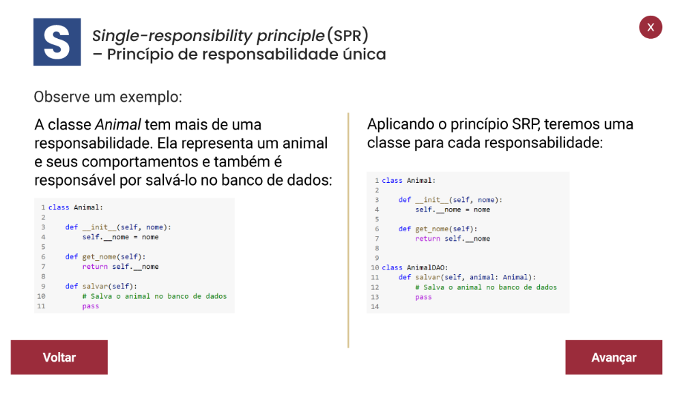

# O

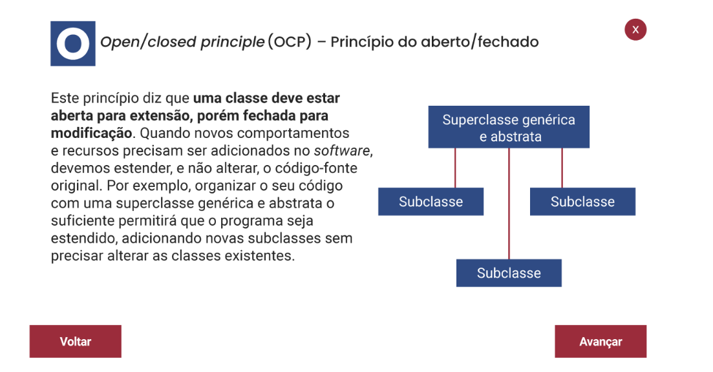

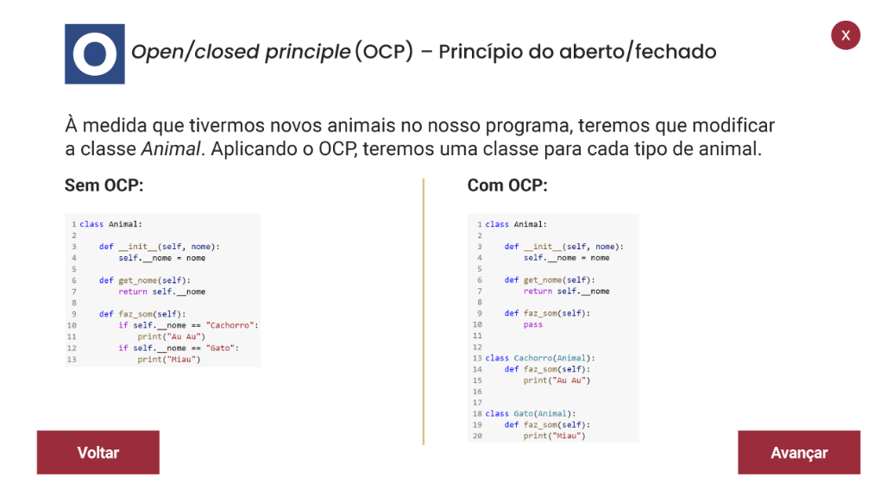

# L

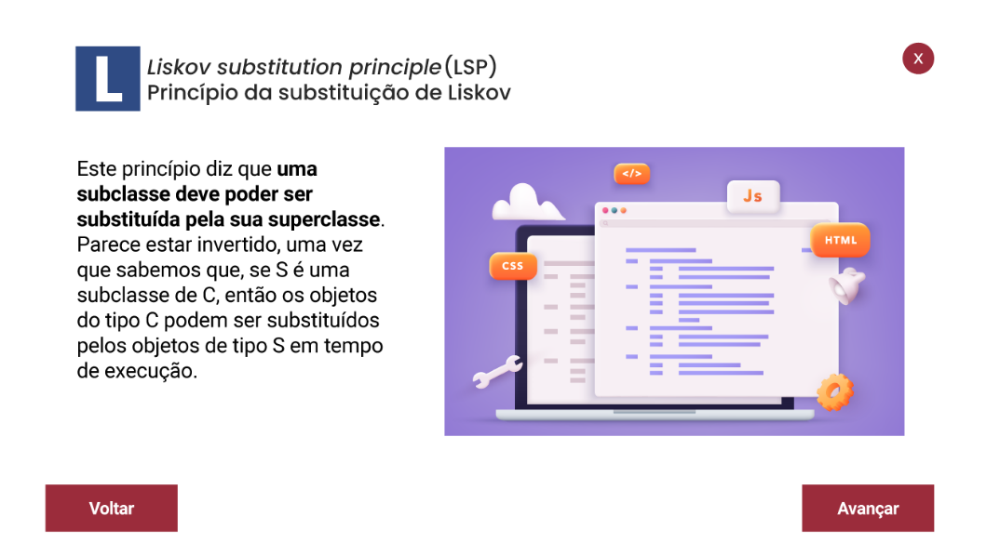

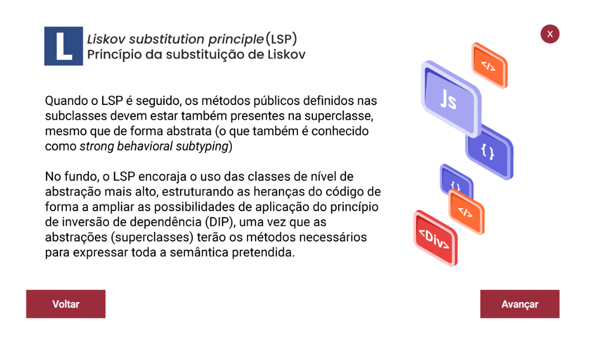

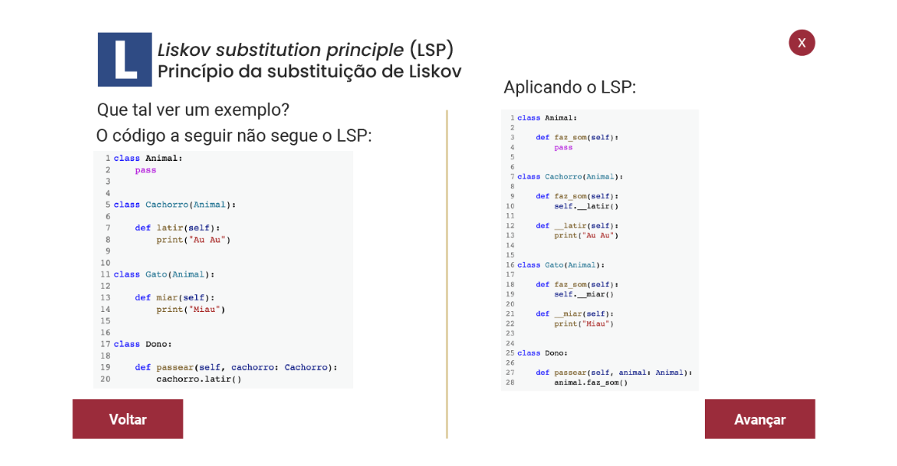

# I

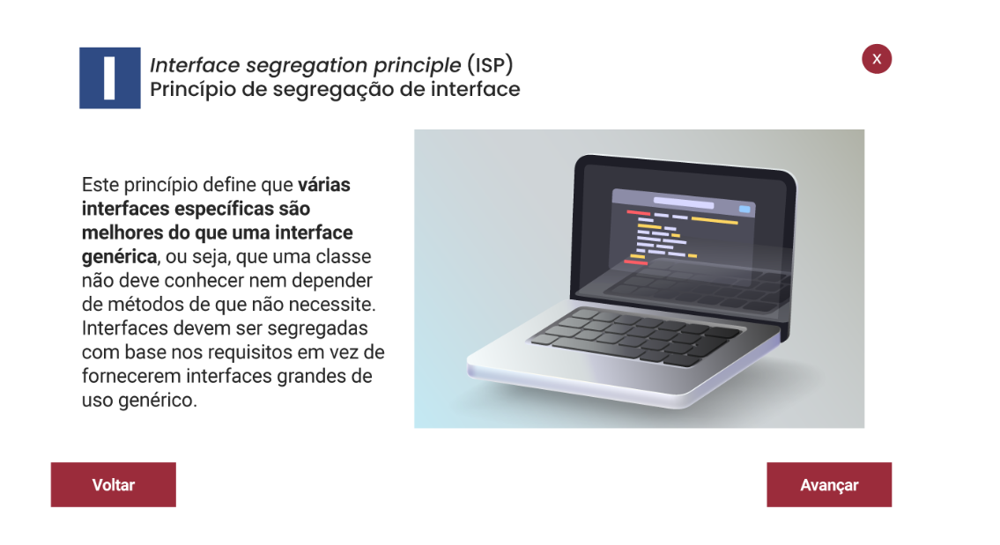

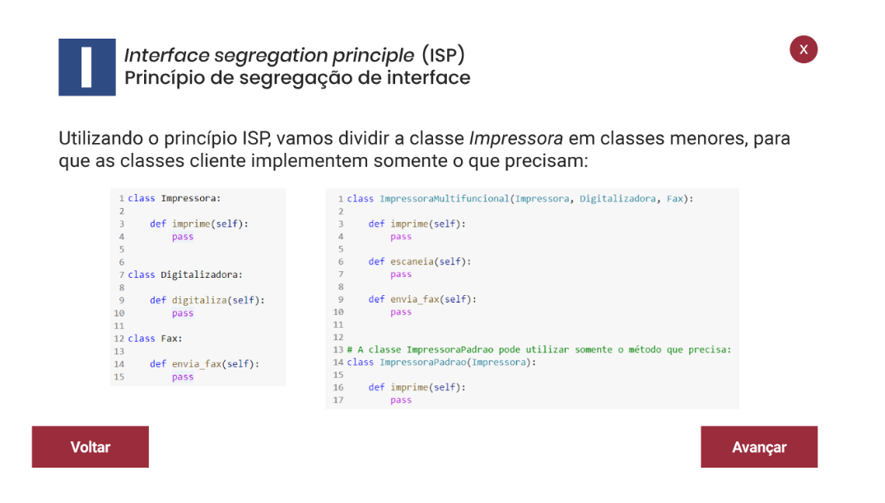

# D

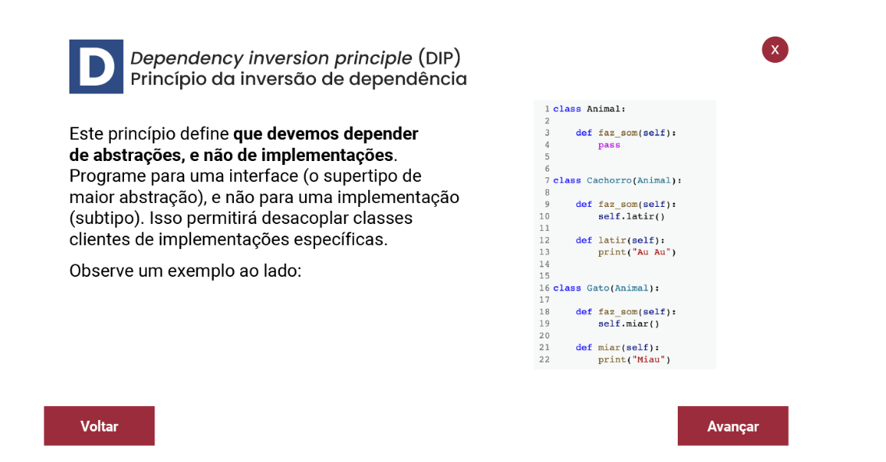

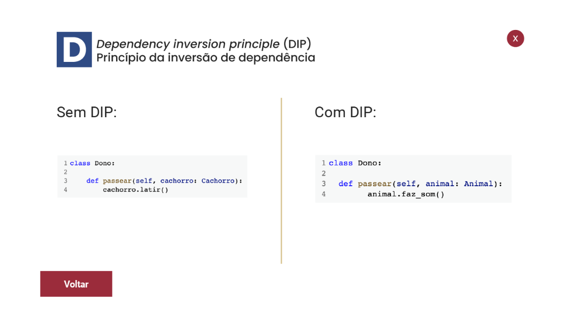

# Nomenclatura

O segundo pensamento do Zen do Python é Explicit is better than implicit, em português explícito é melhor que implícito. 
Isso significa que a clareza quanto ao que queremos desenvolver em um bloco de código é muito importante, o que inclui 
nomear as variáveis, as funções, as classes e os pacotes de forma clara e consistente.

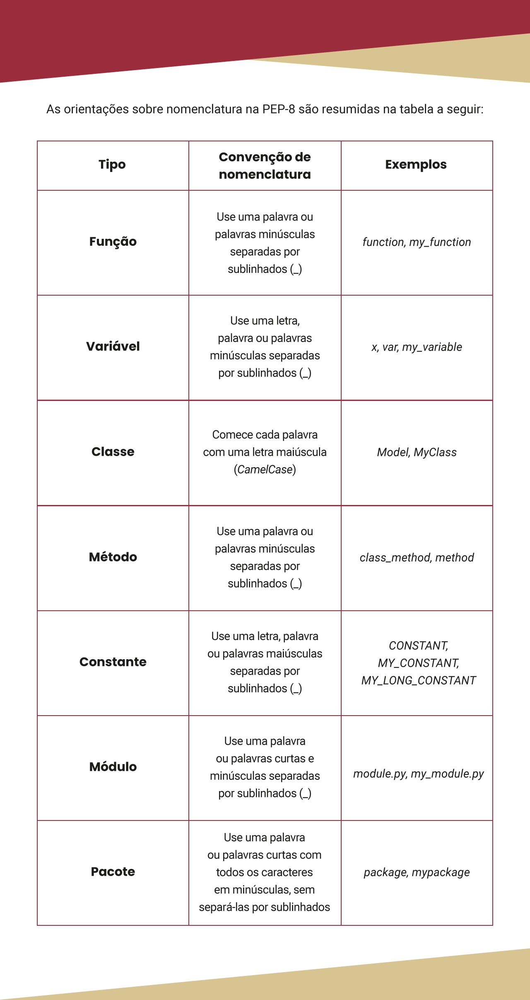

# Clean code
A expressão clean code, em português **“código limpo”** se popularizou com o livro de Robert C. Martin Clean Code: A 
Handbook of Agile Software Craftsmanship, publicado em 2008.

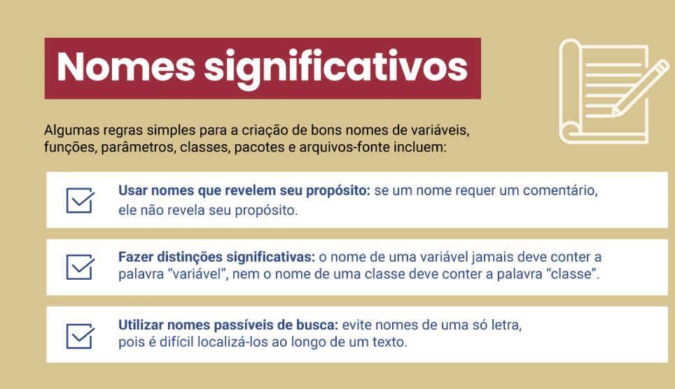

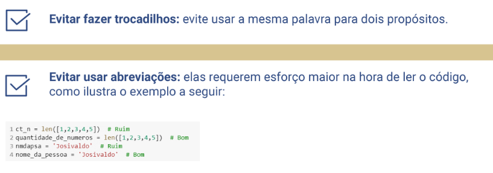

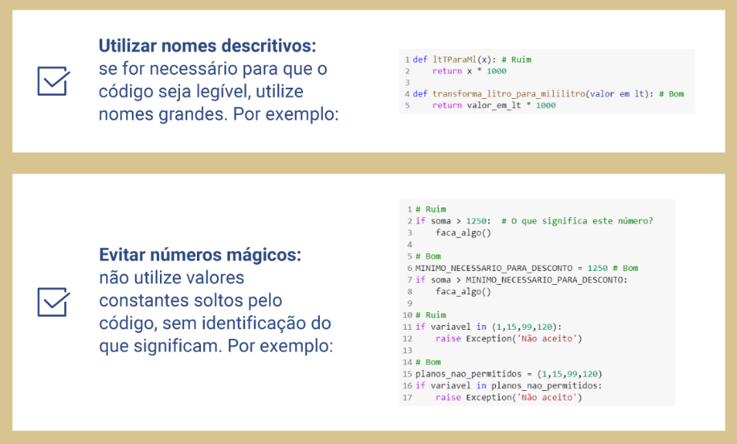

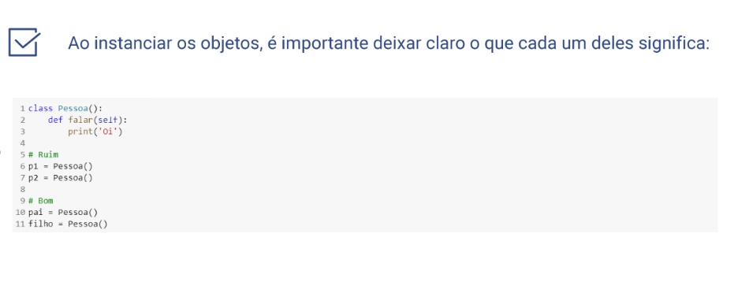

Além dessas boas práticas, há outras muito importantes para você implementar no seu dia a dia.

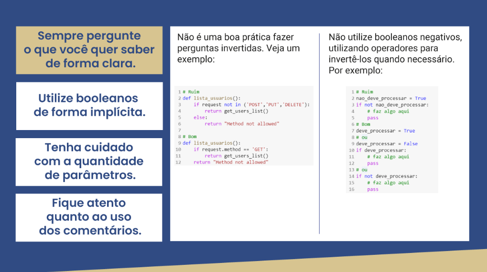

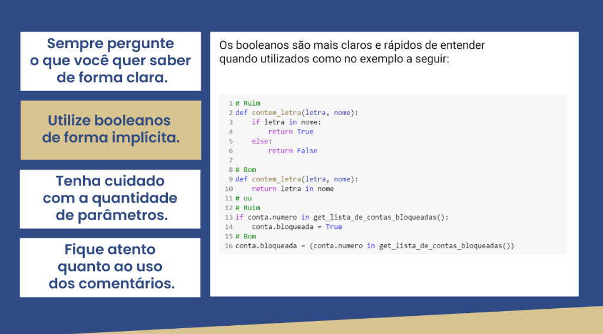

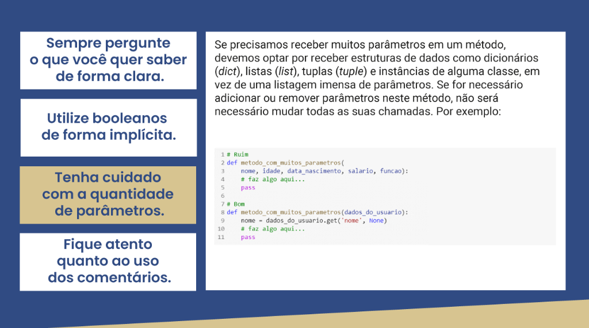

